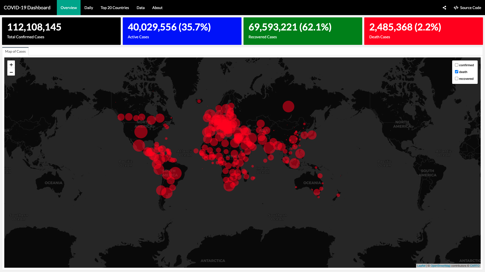

## The COVID-19 Dashboard

This dashboard provides an overview of the COVID-19 (2019-nCoV) epidemic. This dashboard was built with R using [Rmarkdown](https://rmarkdown.rstudio.com/) and the [Flexdashboard](https://rmarkdown.rstudio.com/flexdashboard/index.html) package.

[View the Dashboard](https://benthecoder.github.io/covid19-flexdashboard/)

## Data

The source of data for this dashboard is from the R package [coronavirus](https://github.com/RamiKrispin/coronavirus). With the raw data pulled from the [COVID-19 Data Repository by the Center for Systems Science and Engineering (CSSE) at Johns Hopkins University](https://github.com/CSSEGISandData/COVID-19)

This dashboard updates daily through the Github Actions workflow. You can find the yaml file [here](.github/workflows/main.yml)

## Packages Used

* Dashboard interface - `flexdashboard`
* Visualization - `plotly`, `RColorBrewer`
* Data manipulation - `dplyr`, `tidyr`, `purrr`, `forcats`
* Mapping - `leaflet`, `leafpop`
* Strings - `glue`
* Data Source - `coronavirus`
* Data display - `DT`

## ToDo

- [ ] Add vaccination data and visualizations
- [ ] learn how to dockerize dashboard for github actions to run image
- [ ] Add news section to dashboard for latest news
- [ ] Research better ways to present dashboard with new functionalities
- [ ] Add [dygraphs](https://rstudio.github.io/dygraphs/) to plots

## References for github actions for R 
* [automate yml](https://github.com/lc5415/COVID19/blob/master/.github/workflows/automate.yml)
* [r-lib/actions](https://github.com/r-lib/actions/tree/master/examples#readme)

## Tutorial on how to host flexdashboard on github pages
* [pbatey/flexdashboard-example](https://github.com/pbatey/flexdashboard-example)

## Credits
* [Rami Krispin](https://github.com/RamiKrispin/coronavirus_dashboard)
